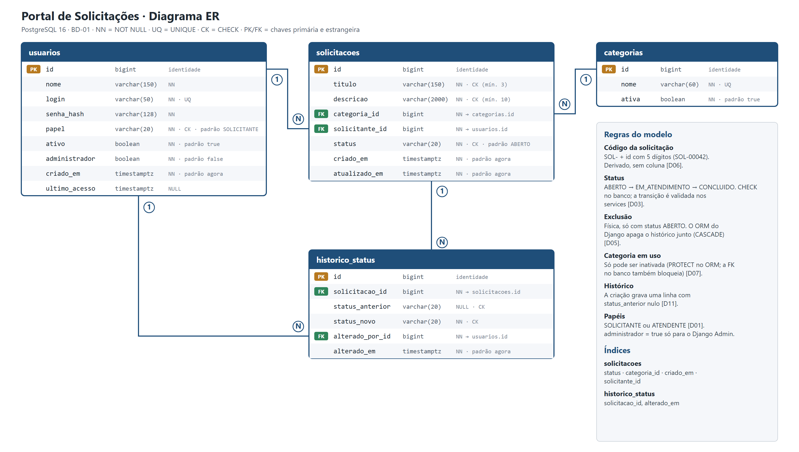

# Modelo de dados

Definido no card BD-01 a partir das decisões do PLN-01 (D01 a D11). Diagrama: [diagrama-er.png](diagrama-er.png) (fonte vetorial em [diagrama-er.svg](diagrama-er.svg)).



## Tabelas

Banco: PostgreSQL 16 (testado também no 17). Todas as chaves primárias são `bigint` com identidade. Datas são `timestamptz`. Onde a tabela diz "padrão agora", o banco usa `STATEMENT_TIMESTAMP()`, que é como o Django traduz `Now()` no PostgreSQL.

### usuarios

| Coluna | Tipo | Restrições |
| :-- | :-- | :-- |
| id | bigint | PK |
| nome | varchar(150) | NOT NULL |
| login | varchar(50) | NOT NULL, UNIQUE |
| senha_hash | varchar(128) | NOT NULL |
| papel | varchar(20) | NOT NULL, CHECK em (`SOLICITANTE`, `ATENDENTE`), padrão `SOLICITANTE` |
| ativo | boolean | NOT NULL, padrão `true` |
| administrador | boolean | NOT NULL, padrão `false` |
| criado_em | timestamptz | NOT NULL, padrão agora |
| ultimo_acesso | timestamptz | NULL. Guarda o último login (campo `last_login` do Django, usado pelo simplejwt) |

### categorias

| Coluna | Tipo | Restrições |
| :-- | :-- | :-- |
| id | bigint | PK |
| nome | varchar(60) | NOT NULL, UNIQUE |
| ativa | boolean | NOT NULL, padrão `true` |

### solicitacoes

| Coluna | Tipo | Restrições |
| :-- | :-- | :-- |
| id | bigint | PK |
| titulo | varchar(150) | NOT NULL, CHECK `char_length(btrim(titulo)) >= 3` |
| descricao | varchar(2000) | NOT NULL, CHECK `char_length(btrim(descricao)) >= 10` |
| categoria_id | bigint | NOT NULL, FK → categorias(id) |
| solicitante_id | bigint | NOT NULL, FK → usuarios(id) |
| status | varchar(20) | NOT NULL, CHECK em (`ABERTO`, `EM_ATENDIMENTO`, `CONCLUIDO`), padrão `ABERTO` |
| criado_em | timestamptz | NOT NULL, padrão agora |
| atualizado_em | timestamptz | NOT NULL, padrão agora (o ORM também o atualiza a cada `save()`) |

### historico_status

| Coluna | Tipo | Restrições |
| :-- | :-- | :-- |
| id | bigint | PK |
| solicitacao_id | bigint | NOT NULL, FK → solicitacoes(id) |
| status_anterior | varchar(20) | NULL (nulo na criação), CHECK nos mesmos valores de status |
| status_novo | varchar(20) | NOT NULL, CHECK nos mesmos valores de status |
| alterado_por_id | bigint | NOT NULL, FK → usuarios(id) |
| alterado_em | timestamptz | NOT NULL, padrão agora |

Restrição adicional: CHECK `status_anterior IS NULL OR status_anterior <> status_novo`, pois alterar para o mesmo status não é permitido (RN09).

## Relacionamentos

| De | Para | Cardinalidade | Na exclusão (ORM do Django) |
| :-- | :-- | :-- | :-- |
| solicitacoes.solicitante_id | usuarios | N para 1 | PROTECT: usuário com solicitações não é excluído |
| solicitacoes.categoria_id | categorias | N para 1 | PROTECT: categoria em uso só pode ser inativada (D07) |
| historico_status.solicitacao_id | solicitacoes | N para 1 | CASCADE: a exclusão física leva o histórico junto (D05) |
| historico_status.alterado_por_id | usuarios | N para 1 | PROTECT |

O Django não cria `ON DELETE CASCADE` no banco: as chaves estrangeiras são `DEFERRABLE INITIALLY DEFERRED` e sem ação, e o `CASCADE` e o `PROTECT` acima são aplicados pelo ORM. Num `DELETE` direto em SQL, o banco bloqueia a exclusão de qualquer registro referenciado, inclusive uma solicitação com histórico. A exclusão de solicitações deve, portanto, passar pelo service, nunca por SQL avulso.

## Decisões do modelo

- **Código da solicitação (D06):** não há coluna. O código é `SOL-` mais o `id` com cinco dígitos (`SOL-00042`), montado pelo serializer e somente leitura. Isso substitui a coluna `codigo` UNIQUE da proposta inicial do card.
- **Perfil (D01):** o campo se chama `papel`, como definido no PLN-01, e não `perfil`. O superusuário do Django Admin recebe `administrador = true` e mantém o papel padrão; ele não usa o portal.
- **`ativo`:** o login só aceita usuário ativo (validação de credenciais da seção 5 das regras de negócio).
- **`ativa` em categorias (D07):** só categorias ativas aparecem no formulário.
- **Status:** guardado como texto com CHECK, e não como enum do PostgreSQL, porque alterar um CHECK por migration é mais simples do que alterar um tipo enum. A ordem das transições (RN09) é validada nos services, não no banco.
- **Histórico (D11):** a criação grava uma linha com `status_anterior` nulo, e cada mudança de status grava outra, na mesma transação.
- **Exclusão (D05):** física, somente com status `ABERTO`. A exclusão lógica fica na Análise Crítica do Memorial como prática de produção.
- **Limites de texto:** 3 a 150 caracteres no título e 10 a 2000 na descrição (seção 5 das regras de negócio). O banco reforça o limite superior pelo tipo e o inferior pelo CHECK; a mensagem por campo vem da API.

## Índices

| Tabela | Colunas | Motivo |
| :-- | :-- | :-- |
| solicitacoes | status | filtro por status e contagens do dashboard |
| solicitacoes | categoria_id | filtro por categoria |
| solicitacoes | criado_em | filtro por período e ordenação (mais recente primeiro) |
| solicitacoes | solicitante_id | visibilidade do Solicitante (D04), aplicada em toda consulta |
| historico_status | solicitacao_id, alterado_em | histórico de uma solicitação em ordem cronológica |

## Nomes físicos e o Django

Os models fixam os nomes do diagrama com `Meta.db_table` (`usuarios`, `categorias`, `solicitacoes`, `historico_status`). O Django nomeia as colunas de chave estrangeira com o sufixo `_id` (`categoria_id`, `solicitante_id`, `alterado_por_id`).

O model `Usuario` não usa o `PermissionsMixin`, então não há tabelas de grupos e permissões do usuário. As propriedades `is_active`, `is_staff` e `is_superuser` que o Django e o Admin esperam leem os campos `ativo` e `administrador`; o campo `password` grava na coluna `senha_hash` e `last_login` grava em `ultimo_acesso`.

Além das quatro tabelas do domínio, o `migrate` cria as tabelas internas do Django (`django_migrations`, `django_admin_log`, `django_session`, `django_content_type`, `auth_permission` e `auth_group*`).

## Como criar o banco do zero

Duas formas equivalentes, ambas verificadas num banco vazio:

```bash
# 1. Pelo Django (cria também as tabelas internas), dentro de backend/
python manage.py migrate
python manage.py carregar_seed

# 2. Por SQL puro, na raiz do repositório
psql "$DATABASE_URL" -f database/schema.sql
psql "$DATABASE_URL" -f database/seed.sql
```

O `seed.sql` pode ser executado mais de uma vez sem duplicar registros.
